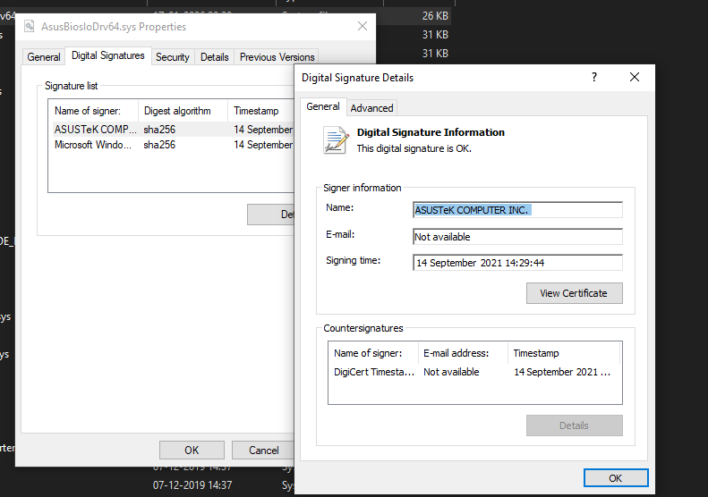

# AsusDrv


# Origin
Don't really remember where i grabbed this driver from, but it was a BIOS IO tool by Asus iirc.<br>
Exposes ZwMapViewOfSection ioctl for mapping/unmapping arbitrary physical memory to usermode.


## Features

```cpp

	uintptr_t GetSystemCR3(); 
    // two ways: walk physical pages for the 0xa0 magic or by leaking eprocess->dtb field superfetch translate and read physical address directly
  
	uintptr_t GetProcessCr3(const wchar_t* ProcessName); 
    // leak eprocess->dtb from usermode; superfetch translate and read physical address directly
  
	uintptr_t MapPhysical(_In_ ULONG_PTR PhysicalAddress, _In_ ULONG NumberOfBytes, _Inout_ HANDLE* SectionHandle, _Inout_ PVOID* Object);
	bool UnmapPhysical(_In_ PVOID AdressToUnmap, HANDLE Section, PVOID Object);
  
	bool ReadPhysicalMemory(uintptr_t physical_address, void* output, unsigned long size);
	bool WritePhysicalMemory(uintptr_t physical_address, void* data, unsigned long size);

	BOOL SwitchSystemContext();
    // wrapper pretty much, to switch cr3 for virtual read contexts to the system cr3

	BOOL SwitchProcessContext(const wchar_t* ProcessName); 
    // wrapper pretty much, to switch cr3 for virtual read contexts to any process by name easily

	UINT64 TranslateLinearAddress(_In_ UINT64 VirtualAddress);
	bool ReadVirtualMemory(PVOID Source, PVOID Buffer, ULONG Size);
	bool WriteVirtualMemory(PVOID Source, PVOID Buffer, ULONG Size);
  ```
---


## Self Plug 
Was used in my other project recently: 
- [BusterCall](https://github.com/zer0condition/BusterCall) - "Bypassing" HVCI via donor PFN swaps to modify read-only code pages. Call chained kernel functions (kCET and SLAT support), modify read-only code pages, and more.

